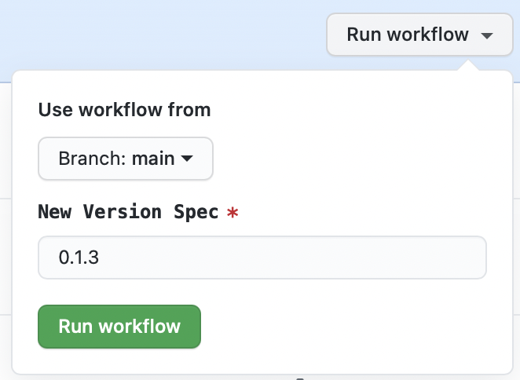
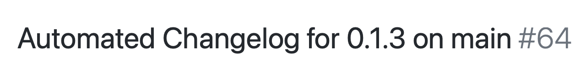
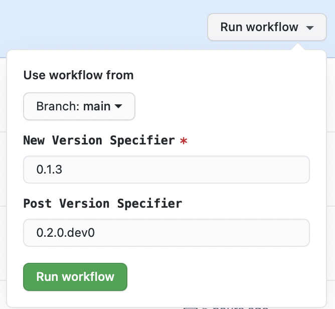
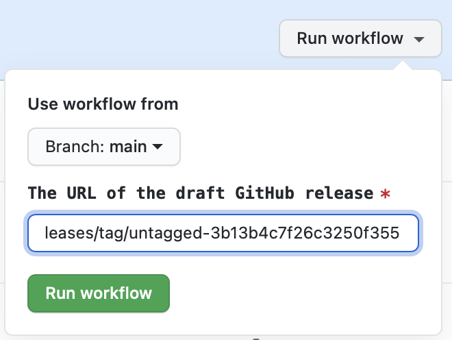

# Release Helper

## Motivation

A set of helper scripts and GitHub Action workflows to aid in automated releases of Python and npm packages.

- Enforces best practices:

  - Has automated changelog for every release (optional)
  - Is published to test server and verified with install and import of dist asset(s)
  - Has commit message with hashes of dist file(s)
  - Has annotated git tag in standard format
  - Has GitHub release with changelog entry
  - Checks url links in markdown files
  - Verifies integrity of Python manifest
  - Reverts to Dev version after release (optional)
  - Ensures packages are publishable on every commit

- Prerequisites (see [checklist](#Checklist-for-Adoption) below for details):

  - Markdown changelog (optional)
  - Bump version configuration (if using Python)
  - Write access to GitHub repo to run GitHub Actions
  - Access token for the test [PyPI registry](https://packaging.python.org/guides/publishing-package-distribution-releases-using-github-actions-ci-cd-workflows/#saving-credentials-on-github) stored as `TEST_PYPI_TOKEN`

- Typical workflow:
  - When ready to make a release, go to the source repository and go to the Actions panel
  - Select the Draft Changelog workflow
  - Run the Workflow with the version spec (usually the new version number), and make sure the target branch is correct

<p align="center">

</p>

- When the run completes, review the changelog PR that was opened, making any desired edits

<p align="center">

</p>

- Merge the PR
- Return to the Actions panel
- Select the Draft Release workflow

<p align="center">

</p>

- Run the Workflow with the same version spec as before, and an optional post version spec if you want to go back to a dev version in the target branch.
- When the workflow completes, go to the releases page in the main repository and verify that the new draft release is there with the correct changelog and dist files.

<p align="center">

</p>

- Run the Publish Release workflow from a fork or manually download an publish the dist file(s). Note: the fork will need to use their own GitHub token in addition to the PyPI/npm token.

<!-- TODO: Add Github release image here -->

## Installation

To install the latest release locally, make sure you have
[pip installed](https://pip.readthedocs.io/en/stable/installing/) and run:

```
    pip install git+https://github.com/jupyter-server/release-helper
```

## Usage

```
    release-helper --help
    release-helper build-python --help
```

## Configuration

All of the commands support CLI and Environment Variable Overrides.
The environment variables are defined by the `envvar` parameters in the
command options in `cli.py`. The environment variables unique to
`release-helper` are prefixed with `RH_`.

The default values can also be overriden using a config file.
Options can be overridden using the `options` section.
You can also define hooks to run before and after
commands in a `hooks` section. Hooks can be a shell command to run or
a list of shell commands, and are specified to run `before-` or `after-`
a command.

This is where `release-helper` looks for configuration:

```code
    .release-helper.toml
    pyproject.toml (in the tools.release-helper section )
    package.json (in the release-helper property)
```

Example `.release-helper.toml`:

```toml
[options]
dist_dir = mydist

[hooks]
before-tag-version = "npm run pre:tag:script"
```

Example `pyproject.toml` section:

```toml
[tools.release-helper.options]
dist_dir = mydist

[tools.release-helper.hooks]
after-build-python = ["python scripts/cleanup.py", "python scripts/send_email.py"]
```

Example `package.json`:

```json
{
  "name": "my-package",
  "release-helper": {
    "options": {
      "dist_dir": "mydist"
    },
    "hooks": {
      "before-publish-dist": "npm run pre:publish:dist"
    }
  }
}
```

## Checklist for Adoption

**Note**: The automated changelog handling is optional. If it is not desired, you can use the
`check_release` and `draft_release` workflows only and leave the changelog calls out of them. You will need to generate your own text for the GitHub release.

- [ ] Switch to Markdown Changelog
  - We recommend [MyST](https://myst-parser.readthedocs.io/en/latest/?badge=latest), especially if some of your docs are in reStructuredText
  - Can use `pandoc -s changelog.rst -o changelog.md` and some hand edits as needed
  - Note that [directives](https://myst-parser.readthedocs.io/en/latest/using/syntax.html#syntax-directives) can still be used
- [ ] Add HTML start and end comment markers to Changelog file - see example in [CHANGELOG.md](./CHANGELOG.md) (view in raw mode)
- [ ] Add [tbump](https://github.com/tankerhq/tbump) support if using Python - see example metadata in [pyproject.toml](./pyproject.toml)

  - We recommend using `setup.cfg` and using `version attr: <package_name>.__version__`, see example [`setup.cfg`](./setup.cfg)
  - See documentation on `setup.cfg` [metadata](https://setuptools.readthedocs.io/en/latest/userguide/declarative_config.html)

- [ ] Add workflows for `check_release`, `draft_changelog`, and `draft_release` - see the workflows in this [repo](./.github/workflows)
- [ ] Change the action calls from the local `./.github/actions/<foo>` to `jupyter-server/release-helper.github/actions/<foo>/@<version_or_branch>`
- [ ] Try out the "Draft Changelog" and "Draft Release" process on a fork first so you don't accidentally push tags and GitHub releases to the source repository.
- [ ] Optionally add workflow for `cancel` to cancel previous workflow runs when a new one is started - see [cancel.yml](./.github/workflows/cancel.yml)
- [ ] Optionally make a new branch or repository on your personal account that has a `publish-release` [workflow](./.github/workflows/publish-release.yml)

  - [ ] You will need to add access tokens for [PyPI](https://packaging.python.org/guides/publishing-package-distribution-releases-using-github-actions-ci-cd-workflows/#saving-credentials-on-github) and/or [npm](https://docs.npmjs.com/creating-and-viewing-access-tokens)
  - [ ] Start with `dry-run: true`, which will target the test pypi registy and use `npm publish --dry-run`
  - [ ] Then switch to the production server once it is fully working.

  ```yaml
  - name: Publish Release
    env:
      TWINE_PASSWORD: ${{ secrets.TEST_PYPI_TOKEN }} # use final when ready to publish PyPI releases
      TWINE_REPOSITORY_URL: https://test.pypi.org/legacy/ # remove when switching to final
    uses: ./.github/actions/publish-release
    with:
      dry_run: true # Set to false when ready to publish GitHub releases
      token: ${{ secrets.GITHUB_TOKEN }}
      release_url: ${{ github.event.inputs.release_url }}
  ```

  - [ ] ⚠ Warning - It is not recommended that you run this workflow or store PyPI/npm credentials on the source repository. Anyone with write access can run a workflow, and access tokens belong to an individual.

- [ ] If desired, add workflows, changelog, and `tbump` support to other active release branches

## Backport Branches

- Create backport branches the usual way, e.g. `git checkout -b 3.0.x v3.0.1; git push origin 3.0.x`
- Make sure you have a copy of the [`forwardport_changelog`](./.github/workflows/forwardport_changelog.yml) workflow into your repository
- When tags are created on a backport branch, an automatic PR is generated for the default branch targeting the appropriate place in the
  changelog.

## Workflow Details

### Draft ChangeLog Workflow

- Manual Github workflow
- Input is the version spec
- Targets the branch selected when starting the workflow
- Bumps the version
  - By default, uses [tbump](https://github.com/tankerhq/tbump) or [bump2version](https://github.com/c4urself/bump2version) to bump the version based on presence of config files
    - We recommend `tbump` instead of `bump2version` for most cases because it does not handle patch releases well when using [prereleases](https://github.com/c4urself/bump2version/issues/190).
- Prepares the environment
  - Sets up git config and branch
  - Exports environment variables to [`GITHUB_ENV`](https://docs.github.com/en/actions/reference/environment-variables) so they can be used in further steps
- Generates a changelog (using [github-activity](https://github.com/executablebooks/github-activity)) using the PRs since the last tag on this branch.
  - Gets the current version and then does a git checkout to clear state
  - Adds a new version entry using a HTML comment markers in the changelog file
  - Optionally resolves [meeseeks](https://github.com/MeeseeksBox/MeeseeksDev) backport PRs to their original PR
- Creates a PR with the changelog changes
- Notes:
  - This can be run on the repo by anyone with write access, since it only needs the built in `secrets.GITHUB_ACCESS_TOKEN`
  - The automated PR does not start workflows (a limitation of GitHub Actions). If you close and open the PR or make edits from within the
    GitHub UI it will trigger the workflows.
  - Can be re-run using the same version spec. It will add new entries but preserve existing ones (in case they have been hand modified).

### Draft Release Workflow

- Manual Github workflow
- Takes a version spec and optional post version spec
- Bumps version using the same method as the changelog action
- Prepares the environment using the same method as the changelog action
- Checks the changelog entry
  - Looks for the current entry using the HTML comment markers
  - Gets the expected changelog values using `github-activity`
  - Ensures that all PRs are the same between the two
  - Writes the changelog entry out to a file to be used as the GitHub Release text
- For Python packages:
  - Builds the wheel and source distributions if applicable
  - Makes sure Python dists can be installed and imported in a virtual environment
- For npm package(s) (including workspace support):
  - Builds tarball(s) using `npm pack`
  - Make sure tarball(s) can be installed and imported in a new npm package
- Checks the package manifest using [`check-manifest`](https://github.com/mgedmin/check-manifest)
- Checks the links in Markdown files
- Adds a commit that includes the hashes of the dist files
- Creates an annotated version tag in standard format
- If given, bumps the version using the post version spec
- Pushes the commits and tag to the target `branch`
- Publishes a draft GitHub release for the tag with the changelog entry as the text
- Notes:
  - This can be run on the repo by anyone with write access, since it only needs the built in `secrets.GITHUB_ACCESS_TOKEN`

### Publish Release Workflow

- Manual Github workflow
- Takes a url for the draft release as an input
- Downloads the dist assets from the release
- Verifies shas and integrity of release assets
- Publishes assets to appropriate registries
- Publishes the draft GitHub release
- ⚠ Warning - It is not recommended that you run this workflow or store PyPI/npm credentials on the source repository. Anyone with write access can run a workflow, and access tokens belong to an individual.

### Check Release Workflow

- Runs on pull requests to the default branch and on push
- Runs the Draft Changelog, Draft Release, and Publish Release Steps
- Publishes to the Test PyPI server
- Deletes the Release
- Does not make PRs or push git changes

## Forwardport Changelog Workflow

- Automatic workflow that runs when a tag is created on a previous branch
- Gets the markdown header prior to the new entry in the backport branch.
  If that header exists in the default branch, insert the new backport entry ahead of it.
- Opens a PR against the default branch with the new entry.
